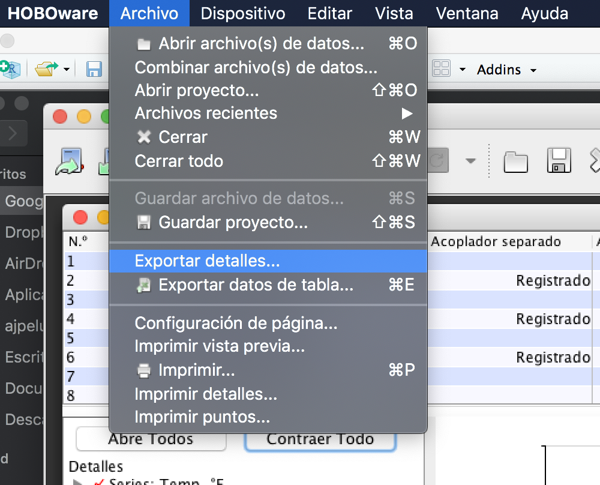
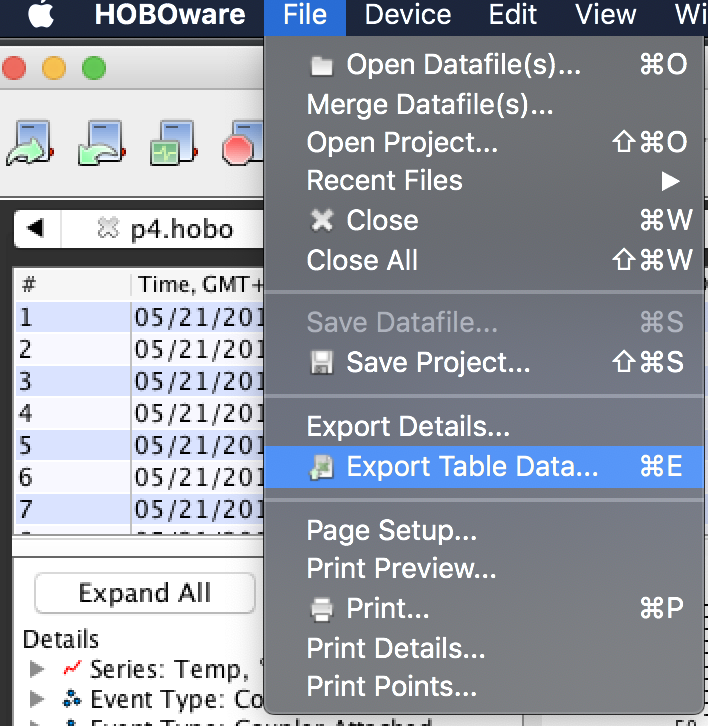
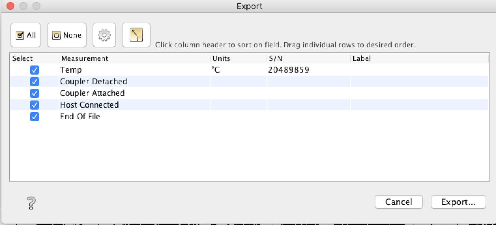

# microclimEnebral

Sensorización del enebral en Sierra Nevada. 

- [Formulario de introducción de datos de las visitas de campo](https://forms.gle/kULKy1tEuW1YsMUc8). En `./forms/visitas_sensores.gform´ se encuentra el formulario. 
- [Datos de las visitas a campo](). En `./forms/visitas_sensores_records.gsheet´ se encuentra la tabla. 

## Metadatos de los sensores desplegados 
- De cada sensor es necesaria una información importante (*e.g.* serial number, fecha de inicio, etc) 
- Se ha creado una función `metadataTidbit()` que obtiene algunos metadatos básicos de cada registrador. En concreto esta función devuelve: 

     - serial number 
     - nombre dado al sensor 
     - tiempo de incio del registrador 
     - tiempo de fin del registrador 

- El script `[./R/get_metadata_tidbit.R`](R/get_metadata_tidbit.R) procesa los archivos de detalle que se pueden obtener a partir de cada archivo `.hobo` para obtener los metadatos de todos los registradores y los exporta como un csv (`sensor_metadata.csv`) que se almacena en [`data/sensor_metadata.csv`](data/sensor_metadata.csv). El procedimiento es el siguiente: 

  - 1. Descarga de los datos en el campo (hobo)
  - 2. Crear una carpeta con los datos brutos por cada fecha de descarga con el nombre YYYY_MM_DD dentro de [`data/hobo_raw`](data/hobo_raw)
  - 3. Copiar (sobreescribir) los datos brutos a [`data/hobo_last`](data/hobo_last) 
  - 4. Abrir los archivos de `hobo_last` con el software HOBOWarePro y exportar de cada archivo `.hobo` un txt de sus detalles, y guardarlo en [`data/hobo_detail`](data/hobo_detail) 
{:height="300px" width="200px"}
  - 5. Ejecutar el script `[./R/get_metadata_tidbit.R`](R/get_metadata_tidbit.R)

## Lectura de los datos de los sensores 

- Abrimos cada archivo hobo presente en [`data/hobo_last`](data/hobo_last) con HOBOWarePro
- Exportamos cada archivo `.hobo` como `.csv`. Para ello clicamos en "Export Table Data" , y luego seleccionamos las variables a exportar . 
- Los datos se guardan en [`data/hobo_last`](data/hobo_last) con formato `.csv`. 

