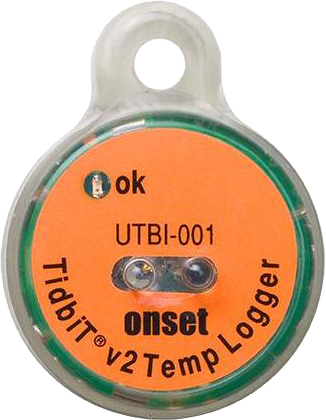
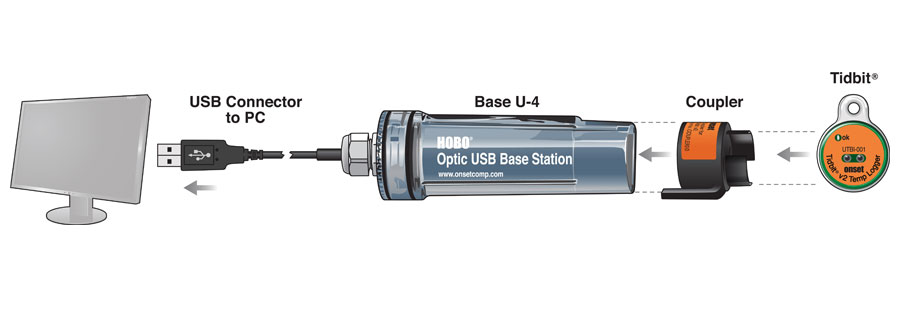

## Registrador de temperatura del suelo en contínuo

Para registrar la temperatura se utilizan un registrador en contínuo **On-set TidbiTv2** (Figura 1), en concreto el modelo [HOBO UTBI-001 TidbiT V2](http://www.onsetcomp.com/products/data-loggers/utbi-001). 

{height=200px}

## Características técnicas 

El **sensor de temperatura** presenta los siguientes características: 

- Rango de medición: -20ºC hasta 70ºC 
- Precisión:  ± 0.21ºC en el rango 0º hasta 50ºC
- Resolución: 0.02 ºC 
- Estabilidad (drift): 0.1ºC por año

Según el fabricante, la **batería** de Litio (3Voltios) tiene una vida útil de 5 años, aunque esto depende del número de inicializaciones (deployments), del intervalo de medida y de la temperatura del registrador (temperaturas del registrador > 35ºC reducen mucho su vida útil). En algunas condiciones extremas se ha visto que a partir del segundo año los registradores dejan de funcionar (*e.g.* Termómetros en las cimas del proyecto GLORIA). 
Cada vez que la batería baja de 2.7 V, el logger registra un evento `Bad battery`. 
 
Para una detallada información técnica consultar [`/doc/technical_documentation_TidbiT.pdf`](technical_documentation_TidbiT.pdf)

### Tipos de medidas 
El registrador diferencia entre `Samples` (muestras) y `Events`: 

- **Samples** son las medidas del sensor en cada intervalo de muestreo (minuto, hora, etc).

- **Events** son ocurrencias generadas por alguna actividad del logger como por ejemplo Bad Battery o Host connected. 

Por ejemplo, cada vez que la batería baja de 2.7 V, el logger registra un evento `Bad battery`. 

## Descarga de los datos

La transferencia de datos se lleva a cabo por medio de un lector óptico que se conecta vía USB a un ordenador (Figura 2). Tanto para la descarga de datos como para inicialización del registrador es necesario disponer del software **HOBOware v 2.2** o superior (www.onsetcomp.com/hoboware-free-download). 

{height=200px}

Para descargar los datos es necesario desenterrar el registrador y conectarlo al lector óptico. Se recomienda ser cauteloso en la conexión al acoplador (coupler) para evitar que se deterioren los módulos de comunicación del registrador. 

Ajustamos preferencias en el software HOBOWarePro para la exportación de datos del formato `.hobo` a `.csv`

* Export type: `.txt or .csv`
* sep: `,`  (comma)
* [x] Separate data and time into two columns
* [x] No quotes or commas in headings, properties in parentheses
* [x] Include sensore serial number of label if available 
* Date format: DMY (28/08/18)
* Date separator: Slash (/)
* Time format: 24-Hour 
* Positive number format: 1,234.56
* Negative number format: -123

Usar la herramienta (plugin) ***Bulk export*** para exportar todos los archivos 

# Correspondencia sensores y puntos de Siembra

```{r, echo = FALSE, message=FALSE, eval=FALSE}
library("here")
library("pander")
sensores <- read.csv(here::here("/data/sensorCorrespondence.csv"), header = TRUE)

knitr::kable(sensores)
```

# Inicializar sensor 

Incluir algo de los manuales 


